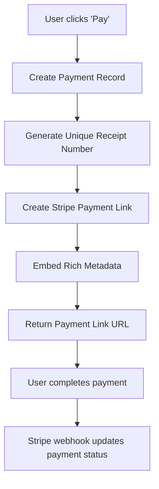

# Dynamic Payment Links System

## Overview

The rental portal now implements a **dynamic payment link system** where each payment transaction gets its own unique payment link. This approach provides better control, security, and tracking compared to the previous static payment link system.

## Key Benefits

### 1. **Unique Payment Context**
- Each payment link is created specifically for a single payment transaction
- Rich metadata is embedded in each payment link for better tracking
- Payment amounts, due dates, and property information are captured in the link

### 2. **Enhanced Security**
- One-time payment links reduce the risk of payment link abuse
- Links expire after 7 days automatically
- Each link is tied to a specific payment record with unique receipt numbers

### 3. **Better Tracking & Analytics**
- Complete audit trail from payment creation to completion
- Detailed metadata for each transaction
- Improved webhook handling with specific payment context

### 4. **Flexible Payment Flow**
- Support for late fees and dynamic pricing
- Ability to create payment links on-demand
- Better handling of payment failures and retries

## System Architecture

### Payment Link Creation Flow



### Metadata Structure

Each payment link contains the following metadata:

```json
{
  "tenantId": "user_id",
  "propertyId": "property_id", 
  "spotId": "spot_id",
  "paymentType": "RENT",
  "dueDate": "2024-01-01T00:00:00.000Z",
  "receiptNumber": "RCP-1234567890-123",
  "propertyName": "Sunset RV Park",
  "tenantName": "John Doe",
  "amount": "1200.00",
  "lateFeeAmount": "50.00"
}
```

## API Endpoints

### 1. Create Payment with Link (Admin Only)

**POST** `/api/v1/stripe/create-payment-link`

Creates a new payment record and generates a unique payment link.

**Request Body:**
```json
{
  "tenantId": "user_id",
  "propertyId": "property_id",
  "spotId": "spot_id", 
  "amount": 1200.00,
  "type": "RENT",
  "dueDate": "2024-01-01T00:00:00.000Z",
  "description": "Monthly Rent Payment",
  "lateFeeAmount": 50.00
}
```

**Response:**
```json
{
  "success": true,
  "message": "Payment created with payment link successfully",
  "data": {
    "payment": {
      "_id": "payment_id",
      "receiptNumber": "RCP-1234567890-123",
      "status": "PENDING",
      "amount": 1200.00,
      "totalAmount": 1250.00
    },
    "paymentLink": {
      "id": "plink_1234567890",
      "url": "https://checkout.stripe.com/pay/...",
      "expiresAt": 1704067200
    }
  }
}
```

### 2. Create Payment Link for Existing Payment (User)

**POST** `/api/v1/users/payments/:paymentId/create-payment-link`

Creates a payment link for an existing pending payment.

**Response:**
```json
{
  "success": true,
  "message": "Payment link created successfully",
  "data": {
    "paymentId": "payment_id",
    "paymentLink": {
      "id": "plink_1234567890",
      "url": "https://checkout.stripe.com/pay/..."
    }
  }
}
```

### 3. Get Payment Link Details (Admin Only)

**GET** `/api/v1/stripe/payment-link/:paymentLinkId`

Retrieves details about a specific payment link.

### 4. Rent Summary with Dynamic Payment Link

**GET** `/api/v1/users/rent-summary`

Returns rent summary with a dynamic payment link for the current month's pending payment.

**Response:**
```json
{
  "success": true,
  "data": {
    "hasActiveLease": true,
    "rentSummary": {
      "paymentLink": {
        "id": "plink_1234567890",
        "url": "https://checkout.stripe.com/pay/..."
      },
      "currentMonth": {
        "status": "PENDING",
        "totalAmount": 1250.00,
        "receiptNumber": "RCP-1234567890-123"
      }
    }
  }
}
```

## Webhook Handling

### Enhanced Webhook Processing

The webhook handler now processes payments using the rich metadata from dynamic payment links:

1. **Extract Metadata**: Pull tenantId, receiptNumber, and other details from payment intent metadata
2. **Find Payment Record**: Locate the existing payment record using the receipt number
3. **Update Payment Status**: Mark the payment as paid and add Stripe transaction details
4. **Handle Failures**: Update payment status for failed or cancelled payments

### Webhook Events Handled

- `payment_intent.succeeded` - Payment completed successfully
- `payment_intent.payment_failed` - Payment failed
- `payment_intent.canceled` - Payment was cancelled

## Database Schema Updates

### Payment Record Structure

```typescript
interface IPayment {
  tenantId: ObjectId;
  propertyId: ObjectId;
  spotId: ObjectId;
  amount: number;
  type: PaymentType;
  status: PaymentStatus;
  dueDate: Date;
  paidDate?: Date;
  receiptNumber: string; // Unique receipt number
  description: string;
  lateFeeAmount?: number;
  totalAmount: number;
  stripeTransactionId?: string; // From webhook
  stripePaymentLinkId?: string; // Payment link ID
  createdBy: string;
}
```

## Implementation Details

### Payment Link Creation

```typescript
// Create payment link with metadata
const paymentLink = await stripe.paymentLinks.create({
  line_items: [{
    price_data: {
      currency: "usd",
      product_data: {
        name: paymentData.description,
        description: `Payment for ${property.name} - ${paymentData.type}`,
      },
      unit_amount: Math.round(totalAmount * 100),
    },
    quantity: 1,
  }],
  metadata: {
    tenantId: paymentData.tenantId,
    propertyId: paymentData.propertyId,
    spotId: paymentData.spotId,
    paymentType: paymentData.type,
    dueDate: paymentData.dueDate.toISOString(),
    receiptNumber: paymentData.receiptNumber,
    propertyName: property.name,
    tenantName: `${user.firstName} ${user.lastName}`,
    amount: totalAmount.toString(),
    lateFeeAmount: (paymentData.lateFeeAmount || 0).toString(),
  },
  after_completion: {
    type: "redirect",
    redirect: {
      url: `${config.client_url}/payment-success?receipt=${paymentData.receiptNumber}`,
    },
  },
  expires_at: Math.floor(Date.now() / 1000) + (7 * 24 * 60 * 60), // 7 days
});
```

### Webhook Processing

```typescript
// Extract metadata from payment intent
const metadata = paymentIntent.metadata;
const receiptNumber = metadata.receiptNumber;

// Find existing payment record
const existingPayment = await Payments.findOne({
  receiptNumber: receiptNumber,
});

// Update payment status
await Payments.findByIdAndUpdate(existingPayment._id, {
  status: "PAID",
  paidDate: new Date(paymentIntent.created * 1000),
  paymentMethod: "ONLINE",
  transactionId: paymentIntent.id,
  stripeTransactionId: paymentIntent.id,
});
```

## Migration from Static Links

### For Existing Users

1. **Remove Static Payment Links**: Users no longer need static payment links stored in their profile
2. **Dynamic Link Generation**: Payment links are created on-demand when needed
3. **Backward Compatibility**: Existing webhook processing continues to work

### Database Changes

- Remove `stripePaymentLinkId` and `stripePaymentLinkUrl` from user profiles
- Keep `stripeCustomerId` for customer lookup fallback
- Add `stripePaymentLinkId` to payment records for tracking

## Security Considerations

1. **Link Expiration**: All payment links expire after 7 days
2. **One-time Use**: Each link is tied to a specific payment transaction
3. **Metadata Validation**: Webhook processing validates all required metadata
4. **User Authorization**: Users can only create links for their own payments

## Error Handling

### Common Error Scenarios

1. **Missing Metadata**: Webhook fails if required metadata is missing
2. **Payment Not Found**: Error if receipt number doesn't match any payment
3. **Duplicate Payments**: Prevents processing the same payment twice
4. **Link Creation Failures**: Graceful handling of Stripe API errors

### Error Responses

```json
{
  "success": false,
  "message": "Payment not found or not eligible for payment",
  "data": null
}
```

## Testing

### Test Scenarios

1. **Create Payment Link**: Verify link creation with correct metadata
2. **Complete Payment**: Test webhook processing with successful payment
3. **Payment Failure**: Test webhook handling for failed payments
4. **Link Expiration**: Verify links expire after 7 days
5. **Duplicate Prevention**: Ensure same payment isn't processed twice

### Test Data

```json
{
  "tenantId": "test_user_id",
  "propertyId": "test_property_id",
  "spotId": "test_spot_id",
  "amount": 1200.00,
  "type": "RENT",
  "dueDate": "2024-01-01T00:00:00.000Z",
  "description": "Test Monthly Rent Payment",
  "lateFeeAmount": 50.00
}
```

## Future Enhancements

1. **Bulk Payment Links**: Create multiple payment links for multiple payments
2. **Payment Scheduling**: Schedule payment link creation for future dates
3. **Advanced Analytics**: Track payment link usage and conversion rates
4. **Custom Expiration**: Allow configurable expiration times
5. **Payment Reminders**: Automatic creation of payment links for overdue payments

## Conclusion

The dynamic payment link system provides a more robust, secure, and flexible payment solution for the rental portal. Each payment transaction now has its own unique context and tracking, making the system more reliable and easier to manage. 